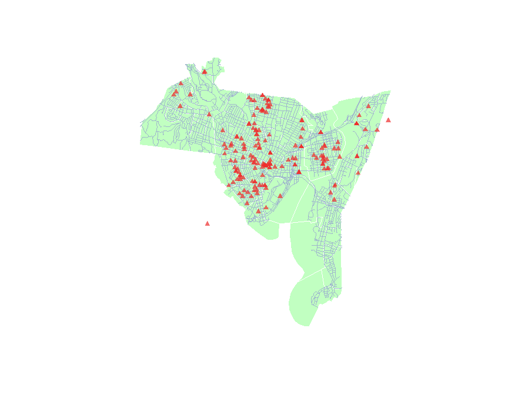
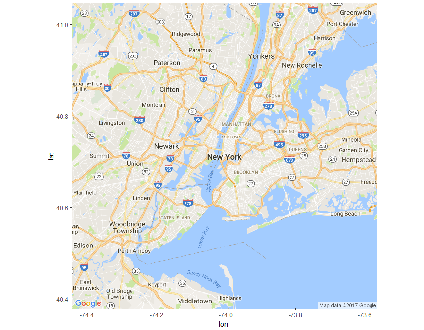
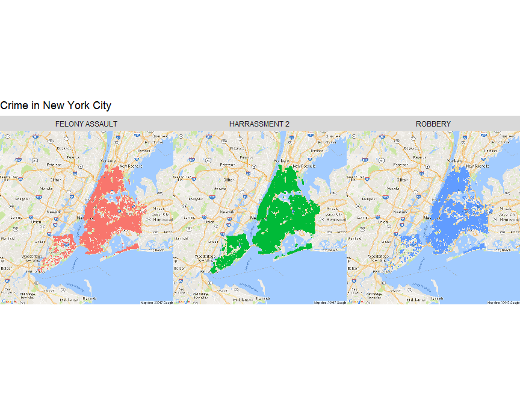
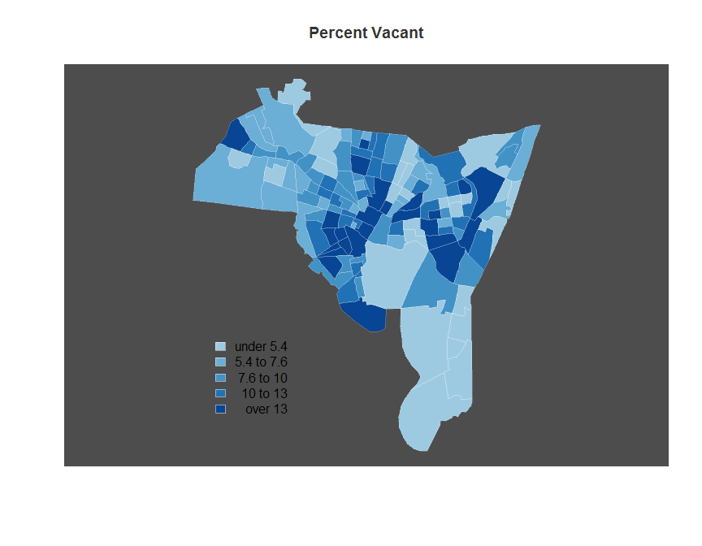
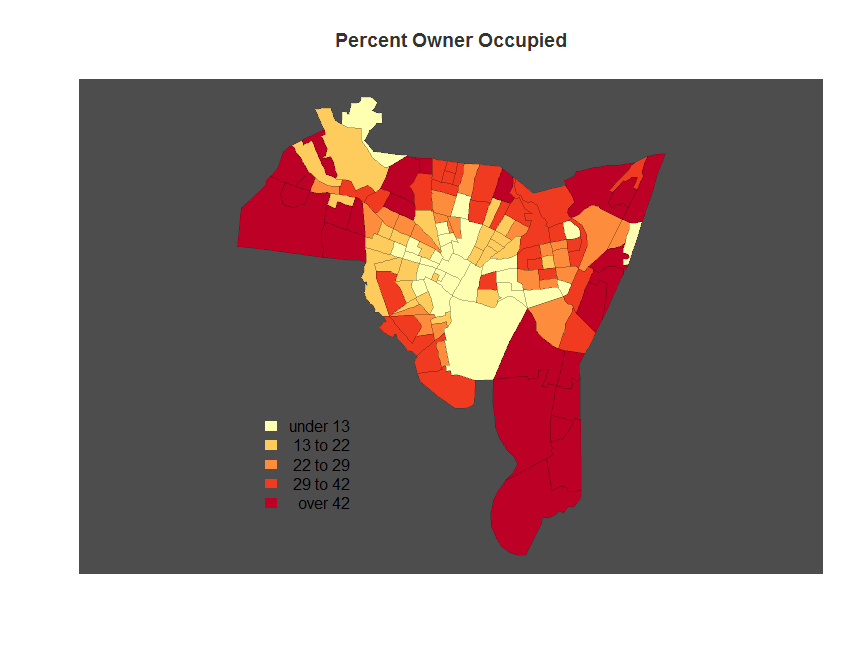
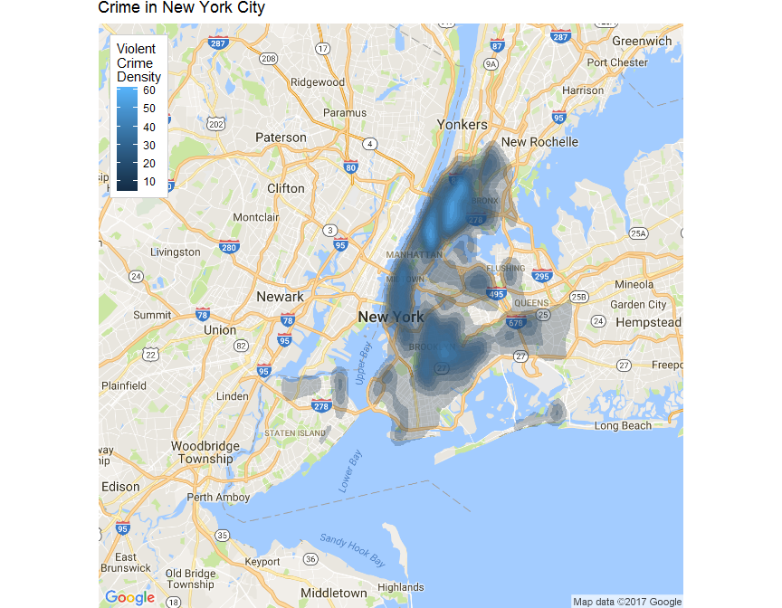

# Introducton to R
Jingtong Feng  


# Basic mapping-crime map

There are many different options for mapping, but we are going to focus on *GIStools*, which depends on several packages, including *maptools*, *rgdal*, and *sp*.


Plotting once these packages (*sp* in particular) are loaded is pretty straightforward; R now knows how to deal with these data types.

Let's make a quick crime map


```r
# head(blocks) # This is a MESS
head(data.frame(blocks))  # Coerce to dataframe first
```

```
##   NEWH075H_ NEWH075H_I HSE_UNITS OCCUPIED VACANT  P_VACANT P_OWNEROCC
## 0         2         69       763      725     38  4.980341   0.393185
## 1         3         72       510      480     30  5.882353  20.392157
## 2         4         64       389      362     27  6.940874  57.840617
## 3         5         68       429      397     32  7.459207  19.813520
## 4         6         67       443      385     58 13.092551  80.361174
## 5         7        133       588      548     40  6.802721  52.551020
##   P_RENTROCC NEWH075P_ NEWH075P_I POP1990  P_MALES P_FEMALES   P_WHITE
## 0  94.626474         2        380    2396 40.02504  59.97496  7.095159
## 1  73.725490         3        385    3071 39.07522  60.92478 87.105177
## 2  35.218509         4        394     996 47.38956  52.61044 32.931727
## 3  72.727273         5        399    1336 42.66467  57.33533 11.452096
## 4   6.546275         6        404     915 46.22951  53.77049 73.442623
## 5  40.646259         7        406    1318 50.91047  49.08953 87.784522
##     P_BLACK P_AMERI_ES P_ASIAN_PI  P_OTHER  P_UNDER5    P_5_13  P_14_17
## 0 87.020033   0.584307   0.041736 5.258765 12.813022 24.707846 7.888147
## 1 10.452621   0.195376   0.521003 1.725822  1.921198  2.474764 0.814067
## 2 66.265060   0.100402   0.200803 0.502008 10.441767 13.554217 5.722892
## 3 85.553892   0.523952   0.523952 1.946108 10.853293 17.739521 7.709581
## 4 24.371585   0.327869   1.420765 0.437158  6.229508  8.633880 2.950820
## 5  7.435508   0.758725   0.834598 3.186646  8.725341  8.194234 3.641882
##     P_18_24   P_25_34   P_35_44  P_45_54  P_55_64   P_65_74   P_75_UP
## 0 12.479132 16.026711  8.555927 5.759599 4.924875  4.048414  2.796327
## 1 71.149463  7.359166  4.037773 1.595571 1.758385  3.712146  5.177467
## 2  8.835341 17.670683 17.871486 8.734940 5.923695  7.931727  3.313253
## 3 12.425150 18.113772 10.853293 9.056886 6.287425  4.266467  2.694611
## 4  7.103825 17.267760 16.830601 8.415301 7.431694 14.426230 10.710383
## 5 10.091047 29.286798 12.898331 7.814871 7.814871  6.904401  4.628225
```

```r
plot(blocks, lwd = 0.5, col = "darkseagreen1", border = "white")  # Plot the 'lowest' first.
plot(roads, add = TRUE, col = "slategray3")  # Roads on top
plot(breach, pch = 17, add = TRUE, col = add.alpha("#EE2C2C", 0.7))  # Add transparency
```

<!-- -->

The *Locator* function lets you interact directly with the plot. You click within the plot, and it returns the coordinates of where you clicked. This is a reasonable way to get the coordinates when you are placing things like legends within the plot.


```r
# locator() # Get Coordinates (commented for markdown)
plot(blocks, lwd = 0.5, col = "cornsilk", border = "antiquewhite2")
plot(roads, add = TRUE, col = "slategray3") 
plot(breach, pch = 20, add = TRUE, col ="red")

# Add a scale bar, if you're into that
map.scale(xc = 540000, yc = 152000, # Position on map, in map units
          len = miles2ft(2), # Length in feet (2 * 5,280)
          units = "Miles", 
          ndivs = 4, 
          subdiv = 0.5)

#locator() # Click once on location, then hit finish button in plot window OR use the Esc key

# North arrow
north.arrow(xb = 540000, yb = 157000, 
            len = miles2ft(.2), # Length of base
            col = "gray60",
            border = "gray30",
            tcol = "gray60") # Color

title(main = 'New Haven, CT.') # Title

title(main = "Crime Infested Wasteland", # Informative subtitle
      line = -.2, # Move down
      col.main = "red3",
      font.main = 4, # Bold italic
      cex.main = 1) # make a little smaller
```

<!-- -->

#Choropleth Maps
This is essentially a basic reference map, but we can also use the attribute data within the spatial classes to make thematic maps, such as choropleth maps. There are many ways to create choropleth maps, including a whole friggin' package called *choroplethr*, but let's use *GISTools* for consistency, which has some functions specifically for that. Let's make two maps with the data we have: percent vacant and percent owner occupied.


```r
# head(data.frame(blocks)) # Look at our data again

colnames(data.frame(blocks)) # Just the attribute names
```

```
##  [1] "NEWH075H_"  "NEWH075H_I" "HSE_UNITS"  "OCCUPIED"   "VACANT"    
##  [6] "P_VACANT"   "P_OWNEROCC" "P_RENTROCC" "NEWH075P_"  "NEWH075P_I"
## [11] "POP1990"    "P_MALES"    "P_FEMALES"  "P_WHITE"    "P_BLACK"   
## [16] "P_AMERI_ES" "P_ASIAN_PI" "P_OTHER"    "P_UNDER5"   "P_5_13"    
## [21] "P_14_17"    "P_18_24"    "P_25_34"    "P_35_44"    "P_45_54"   
## [26] "P_55_64"    "P_65_74"    "P_75_UP"
```

```r
blocks$P_VACANT[1:5] # Can be treated like a dataframe... sometimes  
```

```
## [1]  4.980341  5.882353  6.940874  7.459207 13.092551
```

```r
# hist(blocks$P_VACANT) #Same for graphing
display.brewer.pal(5, "Blues")
```

<!-- -->

```r
# auto.shading builds off of color brewer to create classes
# Needs to be stored separately
shades.blue  <-  auto.shading(blocks$P_VACANT, cols = brewer.pal(7,'Blues')[3:7]) #Create a new color palette

shades.blue # Note class breaks
```

```
## $breaks
##  20%  40%  60%  80% 
##  5.4  7.6 10.0 13.0 
## 
## $cols
## [1] "#9ECAE1" "#6BAED6" "#4292C6" "#2171B5" "#084594"
## 
## attr(,"class")
## [1] "shading"
```

```r
# ?auto.shading # Part of GIStools

choropleth(blocks, 
           v = blocks$P_VACANT, # Variable to be mapped
           shading = shades.blue, # Shading object created above
           bg = "gray30", # Background color
           border = NA # No Border
           ) 

plot(blocks,
     add = TRUE,
     col=NA, 
     border = add.alpha("#FFFFFF", .2) # partly transparent white
     )

# choropleth maps attributes held in SpatialPolygons DataFrame (e.g., 'blocks')
choro.legend(px = 533000, py = 161000, 
             sh = shades.blue,
             border = "#FFFFFF80", # Semitransparent white around boxes
             bg = NA, # No background color,
             bty = "n", # No outer box
             text.col = "red", # Broken apparently
             title.col = "white"
             )

title(main = "Percent Vacant",
      col.main = "gray20")
```

<!-- -->

```r
# Create new set of shades for Owner occupied percentage
shades.yell  <-  auto.shading(blocks$P_OWNEROCC,cols=brewer.pal(5,'YlOrRd')) #Create a new color palette

choropleth(blocks, blocks$P_OWNEROCC, 
           shading = shades.yell, # Shading object created above
           bg = "gray30", # Background color
           border = NA # No Border
           ) 
           
plot(blocks,
     add = TRUE,
     col=NA, 
     border = add.alpha("#000000", .15) # partly transparent black
     )

choro.legend(px = 533000, py = 161000, 
             sh = shades.yell,
             border = NA,
             bg = NA, # No background color,
             bty = "n" # No outer box
             )
# Add title
title(main = "Percent Owner Occupied",
      col.main = "gray20")
```

<!-- -->

Now, what would be even more interesting to put these side by side. Note that color choice is important, so these would probably work better with swapped palettes, since red is usually associated with 'negative' variables.


```r
o.par <- par(no.readonly = FALSE)

# Put them side by side, adjust margins
par(mfrow = c(1, 2), mar = c(1, 0, 1, 0))  # mar =bottom, left, top, right

# Vacant Map
choropleth(blocks, v = blocks$P_VACANT, shading = shades.blue, bg = "gray30", 
    border = NA)
plot(blocks, add = TRUE, col = NA, border = add.alpha("#FFFFFF", 0.2))
choro.legend(px = 533000, py = 161000, sh = shades.blue, border = "#FFFFFF80", 
    bg = NA, bty = "n", text.col = "red", title.col = "white")
title(main = "Percent Vacant", col.main = "white", line = -1)

# Owner Occupied Map
choropleth(blocks, blocks$P_OWNEROCC, shading = shades.yell, bg = "gray30", 
    border = NA)
plot(blocks, add = TRUE, col = NA, border = "gray15")  # Alpha not working on second plot??
choro.legend(px = 533000, py = 161000, sh = shades.yell, border = NA, bg = NA, 
    bty = "n")
title(main = "Percent Owner Occupied", col.main = "white", line = -1)
```

<!-- -->

```r
par(o.par)
```
